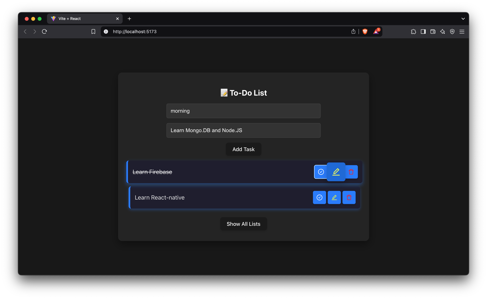
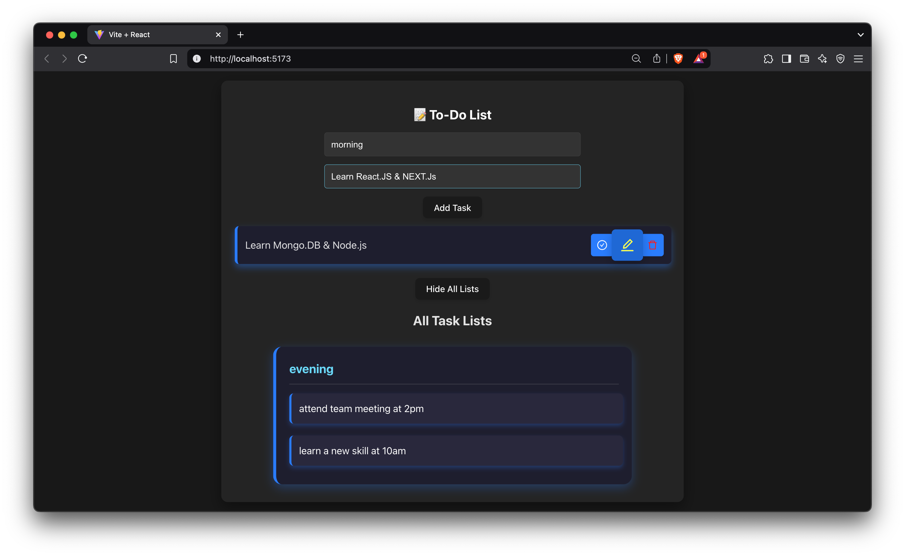
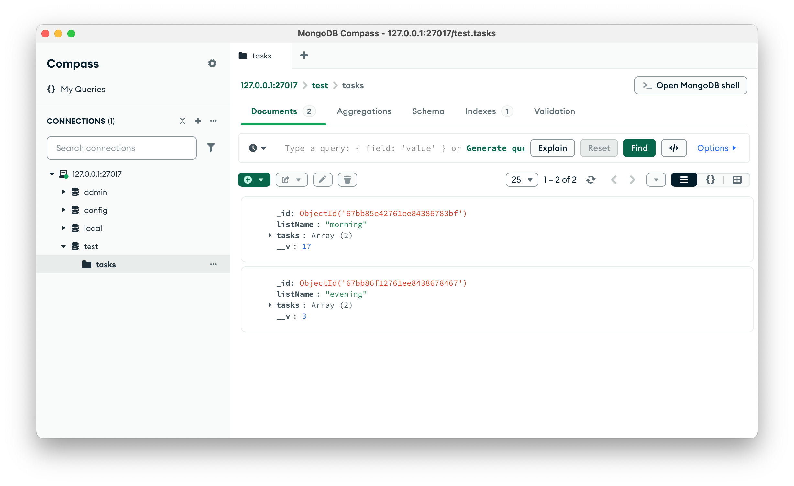

## Introduction

A React.js to-do list application with a Node.js and MongoDB backend. This project demonstrates the implementation of key features such as task management, user authentication, and real-time updates. The app provides a seamless user experience with an intuitive UI, efficient state management, and a secure backend for data storage.

THIS PROJECT WAS PART OF THE ASSIGNMENT GIVEN AS THE FIRST ROUND IN CAPSDATA, COCHIN INFOPARK.

## Overview

## Backend Intergration MONGO.DB & Node.Js

## Application - Overview Video Preview 💻
https://drive.google.com/file/d/1WRnQ9bFbjxtQy_mupMte1d0fVrrJBHvH/view?usp=sharing

## Features

- Create, update, and delete tasks efficiently.
- User authentication for personalized task management.
- Stores tasks securely using MongoDB.
- Responsive UI for a smooth experience across devices.

## Tech Stack

Tech Stack
- Frontend: React.js for building the user interface.
- Backend: Node.js with Express.js for handling API requests.
- Database: MongoDB for storing tasks and user data.
- Axios: For making API calls between the frontend and backend.

